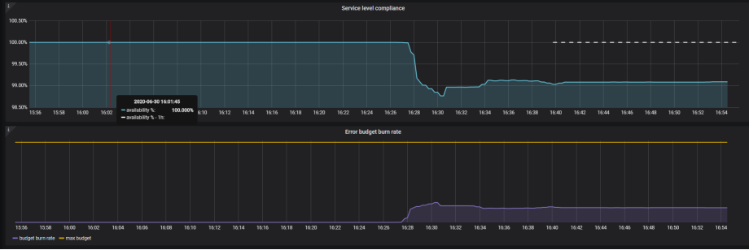

<!-- Because this file contains custom formatting for the heading, we need to
    disable some of the markdownlint rules -->
<!-- markdownlint-disable -->
<p align=center></p>

<h1 align="center">Bringing Azure ApplicationInsight metrics to Prometheus.</h1>

<p align="center">
    <a href="./LICENSE" rel="nofollow"></a>

# Introduction
This image allows you to scrape metrics from Azure Appsights and expose those metrics as an HTTP endpoint for Prometheus to scrape.
This allows engineers to measure Service Level Indicators.

The image is designed purely for SLI metric gathering and not general telemetry data.

1. Configure the queries.yaml file for metrics that you need to scrape.
2. Deploy the Container
3. Configure the SLO Prometheus server to scrape the endpoint for metrics

# Query Generator
Currently only supports Summarize by count. Since we are interested in gauge metrics only for SLI's. This means we want results from Appinsights that are counts.

This query config

```
customCollectors:
    servicelevelindicators:
        - query: 'where resultCode startswith"5"'
          metrictype: counter
          schema: 'requests'
          name: 'requests_failed_total'
          customdimensions:
            - 'Kubernetes.ReplicaSet.Name'
            - 'AspNetCoreEnvironment'
            - 'Kubernetes.Deployment.Name'
```

Will generate the following query summarize count(). This allows for gauge metrics.

```
requests
| where timestamp > datetime(2020-06-23T04:44:53Z)
| where timestamp < datetime(2020-06-23T04:45:53Z)
| where resultCode startswith"5"
| summarize count() by tostring(customDimensions["Kubernetes.ReplicaSet.Name"]),tostring(customDimensions["AspNetCoreEnvironment"]),tostring(customDimensions["Kubernetes.Deployment.Name"])
```

The query generator is designed to filter data for the last minute. The counter metric relies on this.
e.g.
```
where timestamp > datetime(2020-08-17T23:44:05Z) | where timestamp < datetime(2020-08-17T23:45:05Z)
```

# Counter Metric
The query time range is SAMPLE_RATE_SECONDS, default is 60 seconds.
This will ensure the counter increments correctly on aggregated data.
The service will call itself based on the SAMPLE_RATE_SECONDS to increment counter metrics.

# Sample Output
The following shows the sample metrics being published. CustomDimensions defined in the query file are used to generate labels for Prometheus. This allows reuse of the same metric name for different environments.

http://localhost:8080

```
# HELP appinsights_exporter_requests_success_total where resultCode startswith "2" or resultCode startswith "3"
# TYPE appinsights_exporter_requests_success_total gauge
appinsights_exporter_requests_success_total{AspNetCoreEnvironment="Production",Kubernetes.Deployment.Name="samples-dotnet-webapp",Kubernetes.ReplicaSet.Name="samples-dotnet-webapp-8567bf9d5b"} 58.0
# HELP appinsights_exporter_requests_success_total where resultCode startswith "2" or resultCode startswith "3"
# TYPE appinsights_exporter_requests_success_total gauge
appinsights_exporter_requests_success_total{AspNetCoreEnvironment="Production",Kubernetes.Deployment.Name="samples-dotnet-webapp",Kubernetes.ReplicaSet.Name="samples-dotnet-webapp-898c95876"} 29.0
```

# Deployment
Here is an overview of how you can deploy Promitor on your infrastructure, we support both Linux

## Docker

```
docker run -d -p 8999:8080  --name prom-appinsights-exporter \
                            --env AZURE_APP_INSIGHTS_KEY=<azure-appinsights-key>  \
                            --env AZURE_APP_INSIGHTS_APP_ID=<azure-appinsights-appid>   \
                            --env LOG_LEVEL=<info|critical|debug|warning>   \
                            --volume /home/dev/queries.yaml:/config/queries.yaml \
                            romiko/appinsights-prometheus-exporter:1.0.0
```

## Kubernetes

There is a helm chart in my repo that you can use to deploy this to kubernetes.
git@github.com:Romiko/helm-charts.git

```
helm repo add  romiko https://romiko.github.io/helm-charts
helm install romiko/prometheus-appinsights-exporter
```

## Prometheus AppInsights Exporter
This chart will allow you to export metrics from Azure AppInsights into Prometheus.

* Download the chart.
* Update the values.yaml file
* Setup your queries in the files/queries.yaml


<p align=center></p>

## Why
You can use this to export metrics to Prometheus. Using a SLO operator you can then monitor service compliance for application specific logic e.g. Failed Transations etc
This is the fundamentals of Site Reliability Engineering regarding metrics. Define your SLAs -> SLOs -> SLIs

<p align=center></p>

# Dev Environment
* Clone the repository
* Ensure you have Python 3 installed
* Navigate into the AppInsightsExporterApp folder
* Setup Python Virtual Environment - python3 -m venv .myenv
* Use your favourite Python dev tools
* Configure your environment variables (appid, appkey etc)
* Ensure eof is ln and not CRLF
* pip install mock (for unit testing) - Do not include in requirments to keep docker small.

Sample ./.vscode/launch.json

```
{
    "version": "0.2.0",
    "configurations": [
        {
            "name": "Python: Current File",
            "type": "python",
            "request": "launch",
            "program": "./AppInsightsExporterApp/AppInsightsExporter.py",
            "console": "integratedTerminal",
            "env": {
                "AZURE_APP_INSIGHTS_KEY": "mykey",
                "AZURE_APP_INSIGHTS_APP_ID": "myappid",
                "QUERY_FILE": "V:\\dev\\prometheus-appinsights-exporter\\AppInsightsExporterApp\\queries-dev.yaml",
                "LOG_LEVEL": "debug"
            }
        }
    ]
}
```


